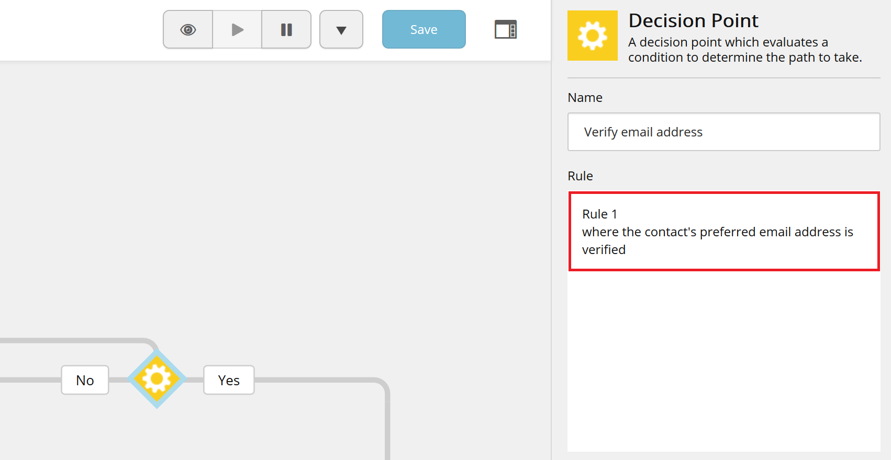

# Sc.EmailValidatedRule

Rule for checking if contact has validated primary email.
Ready to be used in marketing automation.

## Installation

* In Content Management or Standalone server install [Sc.EmailValidatedRule-1.0.zip](sc.package) using Sitecore Installation Wizard.
* (Optionally) copy Sc.EmailValidatedRule.dll to bin folder in Content Delivery server, if you want to use this rule for content personalization.
* Copy Sc.EmailValidatedRule.dll from package zip to `{AutomationEngine}` directory.
* Copy [sc.EmailValidatedRule.Predicates.xml](AutomationEngine\App_Data\Config\sitecore\Segmentation\sc.EmailValidatedRule.Predicates.xml) to `{AutomationEngine}\App_Data\Config\sitecore\Segmentation\` directory. 

## Manual Installation/Install from Source

* Clone repository
* If needed update nuget packages used in Sc.EmailValidatedRule project to match your Sitecore 9 version
* Update `publishUrl` to your Sitecore instance URL in `publishsettings.targets` file
* Update `AutomationEnginePath` to your AutomationEngine root directory in `publishsettings.targets` file
* Update path in `SourceFolderScEmailValidatedRule` variable to your local repository folder in `Sc.EmailValidatedRule.DevSettings.config` file
* (Optionally) publish `Serialization` project from Visual Studio. This project contains Unicorn assemblies and configuration. If you already have Unicorn in your solution you can skip this step.
* Publish `Sc.EmailValidatedRule` project from Visual Studio (this will also publish xml and dll to Automation Engine service directory).   
* Go to {your-sitecore-instance}/unicorn.aspx and sync `Foundation.Sc.EmailValidatedRule` project.